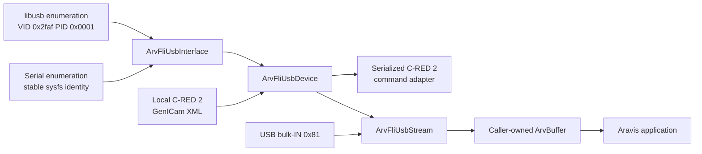
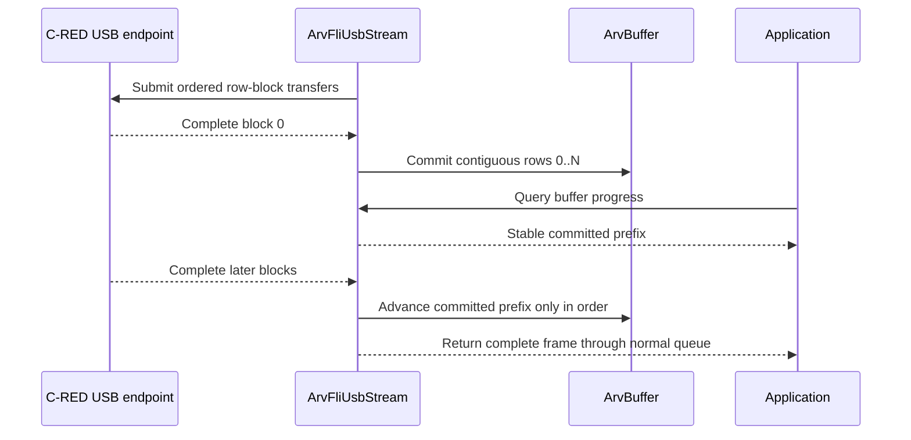

# First Light C-RED proprietary USB transport investigation

Status: research complete enough to plan; implementation and hardware validation
deferred

Last updated: 2026-08-28

## Decision summary

It appears feasible to add native support for the proprietary First Light
Imaging C-RED USB transport to this Aravis fork. This transport is not USB3
Vision and must not be added to `ArvUvInterface`, `ArvUvDevice`, or
`ArvUvStream` as if it used U3V control or stream packets.

If this work proceeds, implement a separate optional Aravis transport with:

- an interface that discovers only the known First Light USB identifiers;
- a device that owns the USB handle, serial association, and a local GenICam
  description;
- a stream that submits asynchronous libusb bulk-IN transfers into queued
  `ArvBuffer` storage; and
- a C-RED control adapter derived from the independently maintained
  `CLProtocol_cred2` command and SFNC mapping, without adding a dependency on
  the GenICam Reference Implementation.

Start with whole-frame acquisition. Treat row-block progressive acquisition as
a later hardware experiment because the inspected FliSdk implementation asks
libusb for complete images, not partial rows.

Do not commit the FliSdk installer, its binaries, extracted SDK files, or
decompiled vendor code to this repository.

## Scope

### Goals

- Preserve the ordinary `ArvCamera`, `ArvDevice`, `ArvStream`, and `ArvBuffer`
  application model for a C-RED 2 connected through its proprietary USB path.
- Expose camera controls through an SFNC-oriented local GenICam XML
  description where the camera has an appropriate SFNC concept.
- Receive whole frames directly into caller-provided Aravis buffers whenever
  their layout and alignment permit it.
- Keep the transport optional at build time and isolated from USB3 Vision.
- Reuse the generic progressive buffer API if hardware experiments prove that
  smaller ordered bulk transfers can expose stable row blocks.
- Preserve Aravis licensing and source provenance by implementing from a
  written interoperability description rather than copying vendor code.

### Non-goals

- Pretend that the camera implements USB3 Vision, GenCP, U3VCP, or U3VSP.
- Link Aravis to FliSdk or redistribute the FliSdk USB plugin.
- Make `CLProtocol_cred2` or the GenICam Reference Implementation a required
  Aravis dependency.
- Claim row-block progress before it is demonstrated on a physical camera.
- Generalize the first implementation to arbitrary Cypress FX2/FX3 devices.
- Support C-RED 3 or C-RED 2 Lite merely because their USB product identifiers
  are listed by the same vendor plugin. Each model requires separate control,
  format, and acquisition qualification.

## Evidence and provenance

The observations below came from static inspection of the user-supplied
`FliSdk_2_9_3_Ubuntu_20_04_NoGui.run` installer. The installer was extracted
without running its installation payload. The inspected artifact identity is:

| Artifact | Identity |
| --- | --- |
| Installer | SHA-256 `9942c58857734ba1e86263d5ecd02a6059046a3428e4c8ac22a69df29af5c595` |
| FliSdk USB release plugin | `libFliSdkPluginUsb.so`, SHA-256 `233124f3b03e56bc8d840b71db71c72d5758c0370b71c02130505c97ee143c5a`, build ID `ddf85fa9ec1b4a6956313492b4a03798351f124e` |
| FliSdk USB debug plugin | `libFliSdkPluginUsbd.so`, SHA-256 `6c321e397e608ca27e452511a31a68adfa94d08cde6f6babfd5ad21f97d9bb2c`, build ID `ebdf453059ba91820c052eca85335f16dc5c186b` |
| USB plugin package metadata | Display name `Frame Grabber USB`, version `1.7.1` |

The release plugin is an x86-64 ELF shared object linked directly to
`libusb-1.0.so.0`. Both release and debug plugins are unstripped. The debug
plugin also contains DWARF type and line information. Symbol names identify
`FliUsbSdk`, `UsbFrameGrabber`, `fli_usb_ctx`, `acquireImages`, and
`xfer_callback` as the relevant implementation units.

These observations establish that FliSdk uses a proprietary libusb transport,
not the Aravis U3V implementation. They do not establish that every camera
firmware or FliSdk release behaves identically.

## Confirmed behavior in the inspected FliSdk USB plugin

### Device identifiers

The bundled `GrabbersConfigs/cyusb.conf` declares First Light vendor ID
`0x2faf` and these product IDs:

| Product ID | Configured name | Planned initial support |
| ---: | --- | --- |
| `0x0001` | C-RED 2 Camera | Yes |
| `0x0002` | C-RED 3 Camera | No; discover only after model support exists |
| `0x0003` | C-RED 2 Lite Camera | No; discover only after model support exists |

The same configuration contains generic Cypress identifiers. A native Aravis
backend must not claim those generic devices.

### Acquisition control

For the inspected plugin, acquisition uses vendor-specific USB control
transfers with no payload:

| Operation | `bmRequestType` | `bRequest` | `wValue` | `wIndex` | Timeout |
| --- | ---: | ---: | ---: | ---: | ---: |
| Start | `0x40` | `0x01` | `0` | `0` | 1000 ms |
| Stop | `0x40` | `0x02` | `0` | `0` | 1000 ms |

The plugin waits approximately 50 ms after either request. The relationship
between these USB requests and the camera's serial acquisition commands still
requires a hardware trace. In particular, the correct ordering among queued
bulk transfers, the USB start request, and camera readout start must not be
inferred solely from one binary.

### Image stream

The inspected implementation:

- reads image data from bulk-IN endpoint `0x81`;
- calculates each request as
  `width * height * 2 * images_per_buffer` bytes;
- allocates and submits 20 asynchronous libusb transfers;
- gives each transfer a 600000 ms timeout;
- accepts a transfer only when `actual_length` equals the requested size;
- calls the frame callback with the transfer buffer; and
- resubmits the same transfer after the callback returns.

The value 20 is an observed FliSdk queue depth, not a known device protocol
requirement. Likewise, two bytes per pixel is confirmed for this code path but
must be reconciled with the camera mode, signedness, endianness, ROI, and any
image tags on hardware.

When image-tag checking is enabled, the plugin interprets the first four bytes
of the received buffer as an image number and applies sequence checking before
delivering it. The exact tag contract, whether the tag replaces pixels or is
additional payload, and its behavior for multi-image buffers remain unresolved.

### Serial control

The USB plugin does not appear to send C-RED camera commands through libusb
control transfers. It enumerates host serial ports using a conventional serial
library, maps a selected USB camera name to a serial object, and implements
`openSerial`, `writeSerial`, and `readSerial` separately from bulk acquisition.

The physical relationship may be a composite USB device, an internal bridge,
or a second USB serial function. Confirm it from descriptors, sysfs topology,
and a hardware capture. Do not associate a camera with a tty by unstable
`/dev/ttyUSB*` or `/dev/ttyACM*` numbering.

## Proposed Aravis architecture

The proposed ownership and data flow are:

`ArvFliUsbDevice` owns the libusb device handle and the associated serial
session. `ArvFliUsbStream` may borrow the USB handle while the device remains
alive, but it exclusively owns active transfer submission and cancellation.
Only the application owns a completed `ArvBuffer`; neither the USB callback nor
another transfer may write that buffer again until the application requeues
it.

### `ArvFliUsbInterface`

Add a distinct interface entry in `src/arvsystem.c`, guarded by a dedicated
build feature such as `ARAVIS_HAS_FLI_USB`. Do not report its protocol as
`USB3Vision`; use an explicit identifier such as `FliUsb` and a protocol string
such as `FirstLightUsb`.

The interface is responsible for:

- enumerating only supported First Light VID/PID pairs;
- reading stable USB identity fields where available;
- finding the corresponding serial function through sysfs ancestry, USB
  serial number, interface number, or another demonstrated stable key;
- rejecting ambiguous device-to-serial associations; and
- opening one `ArvFliUsbDevice` per unambiguous supported camera.

Discovery must not detach kernel drivers, claim interfaces, open ttys, or send
camera commands. Those operations belong to device open.

### `ArvFliUsbDevice`

The device should follow the `ArvDeviceClass` shape already used by native
Aravis devices:

- `create_stream` constructs `ArvFliUsbStream`;
- `get_genicam_xml` returns a local, versioned C-RED 2 XML description;
- `read_memory` and `write_memory` implement a private virtual register space;
  and
- acquisition commands coordinate the camera command session and proprietary
  USB start/stop requests.

The local XML should use SFNC names where they accurately describe the C-RED 2
feature. The virtual register adapter translates register accesses into typed
C-RED serial queries and commands. Volatile values such as temperatures should
query the camera; configuration values may be cached only when cache
invalidation is explicit.

Use `CLProtocol_cred2` as an engineering reference for command grammar,
response parsing, range constraints, and the SFNC mapping. Do not load its C++
CLProtocol ABI from Aravis. Prefer a small Aravis-native typed command layer and
keep the camera description data sufficiently structured that corrections can
be reconciled with the sibling project.

All serial transactions must be serialized. A timeout, malformed response, or
partial response must produce an `ArvDeviceError` without leaving unread bytes
to corrupt the next transaction. Reconnection behavior must be explicit; do
not silently bind a different physical camera after disconnect.

### `ArvFliUsbStream`

The first implementation should request one image per USB transfer. Bind each
active transfer to a queued, sufficiently large `ArvBuffer` so successful
whole frames do not require a FliSdk-style staging ring or an extra image copy.
The transfer context must carry the `ArvBuffer`, expected payload size, capture
generation, and cancellation state.

Acquisition requires a bounded number of in-flight transfers. Make this depth
configurable and determine its default from measurements; do not preserve 20
only because FliSdk uses it. Require enough input buffers before starting to
cover the configured in-flight depth.

If the application exhausts the input queue, the backend must never recycle an
application-owned output buffer. The initial policy should use a bounded
discard/drain transfer to preserve USB stream alignment and increment an
underrun statistic. If hardware proves that stopping transfer submission safely
backpressures the camera without losing frame alignment, this policy can be
revisited.

On stop or disconnect:

1. prevent new transfer submission;
2. send the qualified acquisition-stop sequence;
3. cancel every outstanding libusb transfer;
4. continue handling libusb events until every cancellation callback has run;
5. return affected buffers with an appropriate non-success status; and
6. release USB and serial resources only after callbacks can no longer access
   them.

Short transfers, overflow, stall, cancellation, timeout, and device removal
must have distinct counters and deterministic buffer outcomes. A short
transfer must not be silently presented as a complete image.

## Progressive row-block investigation

The generic `arv_stream_get_buffer_progress()` contract in this fork can
represent stable row-block progress, but the current evidence proves only
whole-transfer completion. The FliSdk plugin submits a full image or full
multi-image buffer, so its callback cannot expose intra-frame progress.

A later prototype may divide one image into smaller, row-aligned asynchronous
bulk transfers that target successive offsets in the same `ArvBuffer`:

This experiment is acceptable only if hardware testing demonstrates all of the
following:

- arbitrary bulk request sizes do not change or stop device streaming;
- the endpoint preserves the expected byte stream across several in-flight
  transfers;
- short packets and frame boundaries are unambiguous;
- ROI rows and any image tags can be mapped to complete application work units;
- the committed prefix never includes bytes that a later callback can rewrite;
  and
- an error can resynchronize at a known frame boundary without publishing
  mixed frames.

Until those conditions hold, report no progressive support for this backend.
Whole-frame operation remains useful and is the correctness oracle.

## Clean implementation boundary

This note records interoperability facts observed from a lawfully obtained
user-supplied SDK artifact. It is not a legal conclusion about the SDK license
or reverse-engineering law. Review the applicable license before distributing
an implementation.

For an ordinary source-provenance boundary:

- keep vendor binaries, SDK headers, installer contents, and disassembly out of
  the Aravis repository;
- implement against public libusb and operating-system APIs;
- represent the transport as original Aravis code following existing Aravis
  conventions;
- add tests from independently written protocol fixtures and physical captures;
- cite this written behavior description in implementation reviews; and
- do not copy control flow, comments, constants unrelated to demonstrated I/O,
  or data structures from the vendor implementation.

If a strict clean-room process is required, separate protocol analysis from
implementation: an analyst with access to the SDK and hardware should publish
an input/output protocol specification and test vectors, while implementers
work only from those artifacts and public APIs.

## Dependency-ordered implementation plan

### Phase 0 — Hardware and license gate

Obtain a C-RED 2 and its supported USB cable/interface. Record:

- `lsusb`, full descriptors, interface and endpoint descriptors;
- sysfs topology for the image and serial functions;
- kernel drivers bound to each interface;
- firmware version, camera mode, ROI, pixel format, and FliSdk version; and
- FliSdk start, steady-stream, stop, disconnect, and reconnect USB captures.

Reconcile the capture with every confirmed operation in this note. Resolve the
camera-to-serial association and acquisition ordering. Review the SDK license
before committing implementation work.

Completion evidence: a versioned protocol fixture containing descriptors and
sanitized transaction traces, with no vendor executable content.

### Phase 1 — Standalone protocol probe

Build a small non-installed test program using libusb and the system serial API.
It should discover exactly one selected camera, open and close it safely, issue
the qualified start/stop sequence, drain a bounded number of complete frames,
and report lengths and image-tag observations without interpreting pixels.

Completion evidence: repeatable acquisition of known-sized frames and clean
shutdown under normal stop, timeout, unplug, and Ctrl-C.

### Phase 2 — Interface and whole-frame stream

Add the optional build feature, interface registration, device skeleton, and
whole-frame stream. Start with fixed C-RED 2 geometry supplied through a
minimal local XML. Write directly into queued `ArvBuffer` memory when possible.

Completion evidence: `arv-tool`, `arv-camera-test`, and a focused transport test
discover the proprietary device without changing U3V discovery; captured
buffers match the standalone probe byte for byte.

### Phase 3 — C-RED 2 GenICam control surface

Add the virtual register adapter and expand the local XML from essential
identity, geometry, exposure, frame-rate, trigger, gain, cooling, and telemetry
features. Reconcile names and constraints with `CLProtocol_cred2` and its
`C-RED2_SFNC_MAPPING.md` rather than translating the vendor GUI mechanically.

Completion evidence: property reads and writes agree with direct serial
queries, invalid values fail without changing camera state, and ROI changes
produce the expected payload size and image layout.

### Phase 4 — Robustness and performance qualification

Qualify bounded buffer ownership, in-flight depth, cancellation, input-buffer
starvation, image tags, long-duration capture, repeated start/stop, and device
removal. Profile copies and callback/event-loop overhead at the required frame
rate.

Completion evidence: no write occurs after an output buffer is handed to the
application; no callbacks outlive their device or stream; counters explain all
failed buffers; and sustained capture meets a documented loss and latency
contract.

### Phase 5 — Conditional row-block progress

Proceed only after whole-frame correctness. Sweep row-aligned request sizes and
in-flight depths while comparing reconstructed frames against the whole-frame
oracle. Implement progress publication only after the conditions in the
progressive investigation section are demonstrated.

Completion evidence: bit-identical frames, a monotonic stable committed prefix,
correct recovery after injected short/error transfers, and measured downstream
latency benefit large enough to justify the added state machine.

## Validation matrix

| Area | Required cases |
| --- | --- |
| Discovery | no device, one camera, two cameras, unsupported PID, ambiguous serial association, U3V camera present simultaneously |
| Geometry | full frame, minimum and representative ROIs, odd/even boundaries allowed by the camera, payload-size changes |
| Acquisition | start/stop, repeated cycles, external and software trigger where supported, input queue exhaustion |
| USB faults | short transfer, timeout, stall, overflow, cancellation, unplug, replug, application shutdown during capture |
| Serial faults | partial response, delayed response, malformed response, stale trailing bytes, disconnect during command |
| Buffer ownership | minimum queue depth, application-held outputs, discard/drain path, cancellation with every transfer active |
| Data | FliSdk or standalone-oracle byte comparison, image-tag on/off, frame sequence, endianness, signedness |
| Progressive | block sizes spanning one and several rows, out-of-order callback observation, short block, frame-boundary recovery |
| Compatibility | builds with feature enabled and disabled; existing Fake, GigEVision, USB3Vision, and GenTL tests unchanged |

## Risks and mitigations

| Risk | Impact | Mitigation |
| --- | --- | --- |
| One SDK release is mistaken for a stable protocol | Breakage on other firmware | Key claims to artifact identity and qualify named firmware versions |
| Serial association uses unstable tty numbering | Commands reach the wrong camera | Require a stable sysfs or serial-number relationship and reject ambiguity |
| USB start occurs before buffers are ready | Initial frame loss or stream misalignment | Determine ordering from hardware traces and test every start cycle |
| Caller buffer is reused while the application owns it | Silent image corruption | Transfer contexts hold explicit ownership; resubmit only requeued buffers |
| Drain policy hides sustained overload | Unbounded scientific data loss | Keep discard capacity bounded and expose underrun/drop counters |
| Image tags are mistaken for pixels | Shifted or corrupted frames | Qualify tag layout for every mode and model before enabling tag parsing |
| Smaller transfers do not preserve device framing | Mixed or truncated progressive frames | Gate progressive support behind whole-frame parity and recovery tests |
| Vendor-derived material enters the source tree | Licensing and provenance concern | Commit only original code, written protocol facts, and independent fixtures |

## Open decisions

1. What exact C-RED 2 firmware and USB hardware revision define the first
   supported configuration?
2. How is the bulk USB function stably associated with its serial command
   function on a multi-camera host?
3. Does the device include image tags in the requested byte count, and what is
   their complete layout?
4. What is the minimum safe in-flight transfer depth at full frame rate?
5. Does transfer starvation backpressure the device safely, or is a discard
   transfer required to preserve frame alignment?
6. Which acquisition operation owns the definitive start/stop ordering: the
   serial camera command, the vendor USB request, or a qualified combination?
7. Can row-sized bulk requests run continuously without firmware-specific
   transfer-size assumptions or short-packet ambiguity?
8. Should the C-RED 2 control description be maintained manually in Aravis, or
   generated with `CLProtocol_cred2` from a shared camera-feature description?
