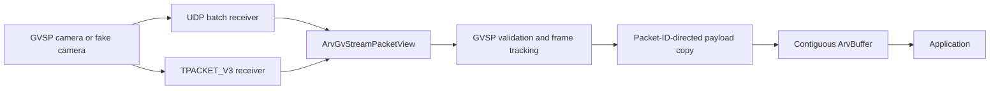

# GVSP receive-performance plan

Status: TPACKET_V3 implementation complete; target-hardware validation pending

Last updated: 2026-08-28

## Decision summary

Improve the native Aravis GVSP receiver in evidence-driven stages:

1. keep `TPACKET_V3` as the accelerated default on Linux;
2. make its receive ring configurable, observable, and safe to fall back from;
3. keep UDP and accelerated receivers behind one packet-view boundary;
4. validate on the target camera NIC before adding AF_XDP; and
5. treat removal of the final payload copy as a separate buffer-layout and
   ownership problem.

AF_XDP is not the next automatic step. It can improve flow steering and reduce
kernel networking overhead, especially with small packets, but it still
delivers packet-sized UMEM frames. It does not assemble those payloads into the
packet-ID-derived offsets of a contiguous `ArvBuffer`.

`io_uring` is not part of either hot receive path. `TPACKET_V3` and AF_XDP use
memory-mapped producer/consumer rings; wrapping their readiness notification in
`io_uring` would not remove packet processing or payload placement. It can be
reconsidered only if measurements identify blocking control I/O as significant.

Rivermax and DPDK are outside the current scope.

## Goals

- Preserve existing GVSP validation, packet resend, frame completion, and
  `ArvBuffer` semantics.
- Sustain the target offered load without packet loss or unbounded queues.
- Make kernel-ring loss, freezes, malformed records, ring capacity, and wakeups
  visible to applications and benchmarks.
- Keep accelerated dependencies optional and retain the standard UDP receiver
  as an initialization fallback and correctness oracle.
- Use only public Linux, Aravis, and dependency documentation.

## Non-goals

- Claim zero-copy when packet payloads are still compacted into an image.
- Publish packet-ring or UMEM memory that the kernel or NIC may overwrite.
- Add an untested AF_XDP implementation without `libxdp`, `libbpf`, and a
  suitable target NIC.
- Replace GVCP camera control or the existing packet resend policy.
- Optimize specifically for the iPORT/NUVU path in this phase.

## Current architecture

Both receive methods now produce a bounded packet view. The view remains owned
by its receive backend only for the duration of `_process_packet_view()`.
Existing frame processing copies payload data that must outlive the view.

The packet view is deliberately small: packet address, packet size, and receive
timestamp. A future AF_XDP backend can produce the same view without changing
frame tracking, but the backend must retain its UMEM descriptor until the view
has been consumed.

## Implemented work

### Isolated correctness and performance workload

`tests/arvgvstreambenchmark.c` uses only the native `GigEVision` interface and
loopback fake camera. It does not enumerate installed GenTL producers or
physical NICs. `tests/fakegv.c` has the same isolation, preventing tests from
consuming discovery traffic intended for camera software.

The workload supports configurable image size, frame rate, packet size, packet
delay, buffer count, ring geometry, block retirement timeout, and forced UDP
fallback. It checks every returned frame and reports application and kernel
ring counters.

### Configurable `TPACKET_V3` ring

The following `ArvGvStream` properties are applied at acquisition start:

| Property | Default | Meaning |
| --- | ---: | --- |
| `packet-socket-block-size` | 2 MiB | Bytes in each ring block |
| `packet-socket-block-count` | 16 | Number of ring blocks |
| `packet-socket-block-timeout` | 5 ms | Kernel partial-block retirement timeout |

The block size must be page aligned and a multiple of the 1024-byte packet-ring
frame size. Invalid or unavailable ring configurations log their reason and
fall back to UDP before frame processing starts.

Packet-ring parsing now uses the kernel-provided network offset, validates the
IPv4 header length and UDP length against the captured record, validates block
and record bounds, and uses acquire/release ordering when transferring block
ownership. Failure to resolve a concrete interface or attach the socket filter
also falls back instead of capturing an unfiltered interface.

### Observability

The stream exposes:

- `packet_socket_active` and `packet_socket_ring_size`;
- `n_packet_socket_blocks`, `n_packet_socket_polls`, and
  `n_packet_socket_poll_timeouts`;
- `n_packet_socket_packets`, `n_packet_socket_drops`, and
  `n_packet_socket_freezes`; and
- `n_packet_socket_malformed_packets`.

These counters complement the existing missing-packet, failed-buffer, and
underrun statistics. Packet-socket statistics are sampled periodically and at
shutdown because reading `PACKET_STATISTICS` resets the kernel counters.

## Baseline evidence

Measurements used Linux 6.12.57 on an AMD Ryzen 7 6800H. The fake camera and
receiver ran on loopback inside an isolated user/network namespace with a
`debugoptimized` build. Each counter result below is three repetitions after a
warmup; `perf record` reported no lost samples.

| Payload workload | Packet size | Delivered result | Kernel-ring result |
| --- | ---: | --- | --- |
| 100 MiB/s | 1400 bytes | 1,800/1,800 complete frames | 0 drops, freezes, or malformed records |
| 200 MiB/s | 8192 bytes | 600/600 complete frames | 0 drops, freezes, or malformed records |
| 400 MiB/s | 8192 bytes | 600/600 complete frames | 0 drops, freezes, or malformed records |
| 800 MiB/s | 8192 bytes | 600/600 complete frames | 0 drops, freezes, or malformed records |

At 800 MiB/s, the three-run mean was 3,364.60 ms of task clock over 3.30961 s
wall time, 14.56 billion cycles, and 9.91 billion instructions. This is a
combined fake-sender and receiver measurement, not a target-NIC performance
claim.

At 100 MiB/s with 1400-byte packets, the receive thread accounted for about
31% of sampled user cycles. Payload-copy instructions reached from
`_process_payload_block()` accounted for about 20% of all samples, or roughly
64% of receive-thread samples. Packet parsing accounted for about 14% and
timing histograms about 7% of receive-thread samples.

At 800 MiB/s with 8192-byte packets, the receive thread accounted for about
38% of sampled user cycles. The payload copy accounted for about 35% of all
samples, or roughly 90% of receive-thread samples. This establishes the final
copy—not polling or packet-ring traversal—as the dominant native-receiver cost
for the high-throughput workload.

A timing-histogram sampling experiment did not produce a repeatable reduction
in aggregate task clock and was removed rather than retained as an unsupported
tuning control.

## Ring-tuning interpretation

A 16 MiB ring and a 32 MiB ring both completed the tested workloads without
loss. Larger blocks and a longer retirement timeout reduced block handoffs and
poll wakeups. A shorter timeout increases handoffs and may lower sparse-stream
or final-block latency, but throughput alone cannot establish that benefit.

Keep the 32 MiB, 5 ms default as a conservative starting point. Tune the
timeout on the actual camera workload using frame-ready latency percentiles,
CPU utilization, packet-ring drops, NIC counters, and application failures.

## AF_XDP decision gate

The current host kernel supports `CONFIG_XDP_SOCKETS`, and the development
environment has the `libxdp` and `libbpf` development packages. The available
GigE Vision systems do not have ConnectX-class hardware; the most capable
expected camera NIC is an Intel X710. For now, validate and tune `TPACKET_V3`
on that X710 rather than add another receive backend. An AF_XDP implementation
is justified only when target-NIC evidence shows material cost outside the
payload copy, such as:

- packet parsing and kernel receive overhead dominate with small packets;
- socket or NIC receive drops occur before memory bandwidth is saturated;
- multiple cameras need explicit hardware-queue steering; or
- CPU affinity and ordinary packet sockets cannot meet the latency contract.

If the gate is met, implement AF_XDP as an optional backend using public
`libxdp`/`libbpf` APIs. Start in copy mode for portability, add zero-copy mode
only for verified driver/NIC combinations, use bounded UMEM and rings, and
preserve automatic fallback to `TPACKET_V3` or UDP during initialization.

AF_XDP acceptance requires bit-identical buffers and matching failure behavior
for packet loss, duplication, reorder, resend, malformed lengths, short final
blocks, and application-held buffer exhaustion. It must show a material CPU or
latency improvement on named hardware; a working socket alone is insufficient.

## Contiguous-image zero-copy gate

AF_XDP does not solve the measured payload-copy hotspot because each packet
occupies a separate UMEM frame and GVSP packet IDs determine image placement.
Removing the copy requires one of these independently designed contracts:

- expose a scatter/gather image downstream and teach consumers to process it;
- register a fixed image arena whose packet slots are safely owned until the
  application releases the frame; or
- use hardware capable of GVSP-aware placement into packet-ID-derived image
  offsets.

The design must preserve reorder and resend behavior and must never return
memory to the NIC while an application owns it. This work is blocked until the
required downstream buffer shape and target hardware are selected.

## Remaining phases and completion evidence

### Phase 1 — Target-NIC baseline

Run the benchmark or an equivalent camera workload on the intended NIC and
camera. Record kernel, Aravis, NIC, interrupt, CPU-affinity, NUMA, MTU, packet
size, and firmware details. Sweep offered load through overload and recovery.

Completion evidence: throughput and frame-ready latency distributions at p50,
p99, p99.9, and maximum; CPU per receive thread; packet-ring and NIC drops; and
application buffer outcomes.

### Phase 2 — Host-network tuning

Tune MTU, camera packet delay, receive-ring geometry, IRQ/RSS placement, and
receive-thread affinity. Do not enable permanent busy polling without a
dedicated-core and power-budget decision.

Completion evidence: a repeatable configuration that meets the target contract
and remains bounded under overload.

### Phase 3 — Deferred, conditional AF_XDP backend

Proceed only if the AF_XDP decision gate is met. Add the optional build feature,
UMEM/ring ownership, XDP flow steering, initialization fallback, counters, and
configuration-matrix tests.

Completion evidence: correctness parity plus a material measured improvement
over tuned `TPACKET_V3` on the same hardware and workload.

### Phase 4 — Conditional image-layout redesign

Proceed only if the remaining payload-copy cost prevents the target contract.
Choose and specify the scatter/gather, registered-arena, or hardware-placement
contract before implementation.

Completion evidence: profiler evidence that eligible frames no longer execute
the payload copy, with safe loss/reorder recovery and bounded buffer ownership.

## Risks and mitigations

| Risk | Impact | Mitigation |
| --- | --- | --- |
| Loopback results are treated as NIC results | Invalid performance claim | Repeat on named target hardware before backend decisions |
| Ring setup silently broadens capture | Interference with camera traffic | Require a concrete interface and attached filter; otherwise fall back |
| AF_XDP adds complexity without addressing the copy | Maintenance cost without benefit | Enforce the profile-based AF_XDP gate |
| Receive memory is recycled while the application uses it | Frame corruption | Make ownership explicit and bounded before any zero-copy publication |
| Larger blocks increase tail latency | Missed real-time target | Sweep retirement timeout and report latency percentiles |
| Application retains every buffer | Ring or stream exhaustion | Keep capacities bounded and report drops/underruns without overwrite |

## Open decisions

1. Which camera, NIC, driver, link rate, image format, and CPU placement define
   the first deployment contract?
2. What sustained throughput and p99/p99.9 frame-ready latency are required?
3. Must downstream consumers receive one contiguous image, or can they accept a
   packet-backed scatter/gather view?
4. If AF_XDP is gated in, which NIC/driver combinations must support zero-copy
   mode rather than copy mode?
